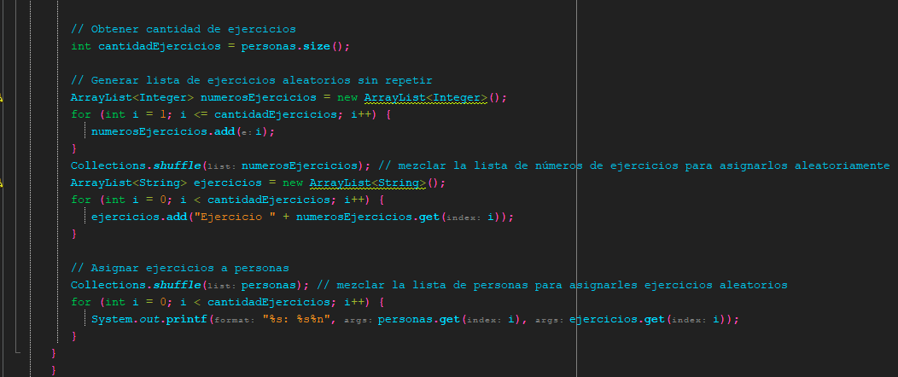

<!-- No borrar o modificar -->
[Inicio](./index.md)

## Sesión 10 

<!-- Su documentación aquí -->

## **Ejercicios de Lógica de Programación**

1. ## **Crear un programa en Java para calcular el interés de un CDT**

Un CDT (Certificado de Depósito a Término) es un producto financiero en el que un inversor deposita una cantidad de dinero en un banco por un plazo determinado y a cambio recibe una tasa de interés fija. Al final del plazo, el inversor recupera su inversión inicial más los intereses generados. Aquí hay un ejemplo de cómo crear un programa en Java para calcular el interés de un CDT:

En este ejemplo, el programa solicita al usuario que ingrese el monto del depósito, la tasa de interés anual y el plazo en meses. Luego, el programa utiliza fórmulas matemáticas simples para calcular el interés mensual y el monto total al vencimiento. Finalmente, el programa muestra un resumen del CDT que incluye el monto del depósito, la tasa de interés anual, el plazo en meses, el interés mensual y el monto total al vencimiento. Este programa puede ser útil para las personas que desean invertir en un CDT y desean calcular los intereses que pueden generar. También puede ser utilizado por los profesionales financieros que deseen calcular los intereses de los CDTs de sus clientes.

2. ## *Calcular la desviación estándar**

La desviación estándar es una medida estadística que indica cuánto varían los valores de un conjunto de datos respecto a la media aritmética. En otras palabras, mide la dispersión de los datos alrededor de la media.

La desviación estándar se calcula tomando la raíz cuadrada de la varianza, donde la varianza es la suma de los cuadrados de las diferencias entre cada valor y la media aritmética, dividido entre el número de valores menos uno.

La fórmula para calcular la desviación estándar es la siguiente:

La desviación estándar se utiliza a menudo en estadísticas para describir la variabilidad de un conjunto de datos. Una desviación estándar más grande indica que los valores están más dispersos alrededor de la media, mientras que una desviación estándar más pequeña indica que los valores están más concentrados alrededor de la media.

Un ejemplo para entender la desviación estándar sería el siguiente:

Supongamos que tenemos un conjunto de datos que representan el número de horas que un grupo de estudiantes estudia por semana. El conjunto de datos es el siguiente:

La varianza nos indica cuánto varían los datos con respecto a la media. En este caso, la varianza es relativamente grande, lo que sugiere que los datos están bastante dispersos alrededor de la media.

Finalmente, calculamos la desviación estándar del conjunto de datos:

La desviación estándar nos indica cuánto se desvían los datos de la media. En este caso, la desviación estándar es relativamente grande, lo que confirma que los datos están bastante dispersos alrededor de la media.

En resumen, la desviación estándar es una medida estadística que indica cuánto varían los datos de la media. En el ejemplo anterior, la desviación estándar nos indica que los datos están bastante dispersos alrededor de la media, lo que sugiere que hay una gran variabilidad en el número de horas que los estudiantes estudian por semana.

Ejemplo en Java para calcular la desviación estándar de un conjunto de datos:

Este código primero calcula la media aritmética del conjunto de datos y luego calcula la desviación estándar utilizando la fórmula que se explicó anteriormente. Finalmente, muestra la media aritmética y la desviación estándar en la consola.

3. ## **Cálculo del índice de masa corporal (IMC)**

El índice de masa corporal (IMC) es una medida que se utiliza para evaluar si una persona tiene un peso saludable en relación con su altura. Se calcula dividiendo el peso de una persona en kilogramos entre el cuadrado de su altura en metros (kg/m²).

El IMC es una herramienta útil para determinar si una persona tiene un peso saludable, está por debajo de su peso ideal o tiene sobrepeso o obesidad. Aunque el IMC no mide directamente la cantidad de grasa corporal, se ha encontrado que existe una relación entre el IMC y el porcentaje de grasa corporal. Por lo tanto, el IMC se utiliza como un indicador general de la salud y el riesgo de ciertas enfermedades relacionadas con el peso, como la diabetes, la hipertensión y las enfermedades cardiovasculares.

Los valores del IMC se interpretan según las siguientes categorías: Bajo peso: IMC menor a 18,5 Peso normal: IMC entre 18,5 y 24,9 Sobrepeso: IMC entre 25 y 29,9 Obesidad grado 1: IMC entre 30 y 34,9 Obesidad grado 2: IMC entre 35 y 39,9 Obesidad grado 3: IMC igual o mayor a 40

Es importante tener en cuenta que el IMC es una herramienta de evaluación general y que no tiene en cuenta otros factores importantes, como la edad, el género, la composición corporal y la distribución de la grasa corporal. Por lo tanto, es recomendable que una evaluación más completa sea realizada por un profesional de la salud.

Ejemplo en Java de cómo calcular el índice de masa corporal (IMC) de una persona:

En este programa, primero se solicita al usuario que ingrese su peso en kilogramos y su altura en metros. Luego se calcula el IMC dividiendo el peso entre la altura al cuadrado. Finalmente, se muestra el resultado en la consola con dos decimales utilizando el método printf de la clase System.out.

4. ## **Calcular la cantidad de materiales necesarios para construir una pared de ladrillos**

Cálculo de la cantidad de materiales para la construcción: Este ejercicio consiste en calcular la cantidad de materiales necesarios para construir una estructura. Para ello, se debe tener en cuenta las dimensiones de la estructura y la cantidad de materiales necesarios por unidad de área o de volumen. Algunos ejemplos de cálculos de materiales son el cálculo de la cantidad de ladrillos necesarios para construir una pared, o el cálculo de la cantidad de concreto necesario para una losa o columna.

Ejemplo en Java de cómo calcular la cantidad de materiales necesarios para construir una pared de ladrillos:

En este programa, además de solicitar las dimensiones de la pared, también se solicitan las dimensiones del ladrillo: largo, alto y ancho. Luego se calcula el área del ladrillo multiplicando el largo por el alto.

Para calcular la cantidad de ladrillos necesarios, se divide el área de la pared entre el área de un ladrillo (considerando las dimensiones del ladrillo ingresadas) y el ancho de la pared dividido por el ancho del ladrillo. El resultado se redondea hacia arriba con la función Math.ceil. Finalmente, se muestra el resultado en la consola utilizando el método printf de la clase System.out.

5. ## **Calcular el movimiento rectilíneo uniforme**

El movimiento rectilíneo uniforme (MRU) es un tipo de movimiento en el cual un objeto se mueve en línea recta y a velocidad constante, es decir, su velocidad no cambia en el tiempo. En este tipo de movimiento, la trayectoria del objeto es una línea recta, por lo que su aceleración es cero.

Un ejemplo común de MRU es un automóvil que se desplaza en una carretera recta y mantiene una velocidad constante durante todo el trayecto. Otro ejemplo es una pelota que cae verticalmente al suelo sin ser afectada por la resistencia del aire.

El MRU es un movimiento importante en la física, ya que permite entender conceptos básicos como la velocidad, la distancia recorrida y el tiempo de desplazamiento. Además, es utilizado como base para otros tipos de movimiento más complejos, como el movimiento rectilíneo uniformemente acelerado (MRUA) y el movimiento circular uniforme (MCU).

Ejemplo en Java de cómo calcular el movimiento rectilíneo uniforme:

En este programa, primero se solicita al usuario que ingrese la velocidad en metros por segundo y el tiempo en segundos.

A continuación, se calcula la distancia recorrida utilizando la fórmula distancia = velocidad x tiempo, donde la velocidad se mide en metros por segundo, el tiempo se mide en segundos y la distancia se mide en metros.

Finalmente, se muestra el resultado en la consola utilizando el método printf de la clase System.out.

6. ## **Calcular el movimiento parabólico de un proyectil**

El movimiento parabólico de un proyectil es un tipo de movimiento en el cual un objeto es lanzado con una velocidad inicial y se mueve siguiendo una trayectoria curva en forma de parábola debido a la influencia de la gravedad. Este tipo de movimiento se caracteriza por tener tanto una componente horizontal como una vertical.

Durante el movimiento parabólico de un proyectil, la fuerza de la gravedad actúa sobre el objeto, lo que hace que la trayectoria del proyectil describa una curva en forma de parábola. La velocidad horizontal del proyectil se mantiene constante a lo largo de todo el recorrido, mientras que la velocidad vertical va disminuyendo debido a la fuerza de la gravedad.

Algunos ejemplos de movimiento parabólico de un proyectil son el lanzamiento de una pelota o de un objeto deportivo como un balón de fútbol o una pelota de béisbol. También este tipo de movimiento es muy común en el lanzamiento de cohetes y en otros procesos de lanzamiento de objetos en la industria espacial.

El movimiento parabólico de un proyectil es importante en la física ya que permite entender conceptos como la velocidad, la aceleración, la distancia recorrida y la altura máxima alcanzada por el proyectil. Además, es utilizado en diversas aplicaciones prácticas como en la industria aeroespacial, en la ingeniería de cohetes y en la física de las fuerzas del movimiento.

Espero que esta explicación te haya sido útil para entender qué es el movimiento parabólico de un proyectil.

El ángulo que produce la mayor distancia para un proyectil lanzado con una velocidad inicial dada es de 45 grados. Este ángulo se conoce como el ángulo de lanzamiento óptimo.

La razón por la cual el ángulo de lanzamiento óptimo es de 45 grados es que a este ángulo, la velocidad inicial del proyectil se descompone en dos componentes iguales, una horizontal y otra vertical. La componente horizontal de la velocidad se mantiene constante durante todo el vuelo del proyectil, mientras que la componente vertical disminuye debido a la fuerza de la gravedad.

A medida que el ángulo de lanzamiento se acerca a 0 grados (lanzamiento horizontal), la distancia recorrida por el proyectil disminuye debido a que la componente vertical de la velocidad se vuelve muy pequeña. Por otro lado, a medida que el ángulo de lanzamiento se acerca a 90 grados (lanzamiento vertical), la distancia recorrida también disminuye debido a que la componente horizontal de la velocidad se vuelve muy pequeña.

En resumen, el ángulo de lanzamiento óptimo para maximizar la distancia recorrida por un proyectil lanzado con una velocidad inicial dada es de 45 grados.

A continuación te presento un ejemplo en Java de cómo calcular el movimiento parabólico de un proyectil:

En este programa, primero se solicita al usuario que ingrese la velocidad inicial en metros por segundo, el ángulo de lanzamiento en grados y la altura inicial en metros.

A continuación, se calcula la velocidad en los ejes x e y utilizando las fórmulas:

donde velocidadInicial es la velocidad inicial del proyectil, angulo es el ángulo de lanzamiento en grados, cos y sin son las funciones trigonométricas del coseno y el seno, respectivamente.

Luego, se calcula el tiempo de vuelo utilizando la fórmula:

Se muestra el resultado de la distancia recorrida, la altura máxima alcanzada y el tiempo de vuelo en la consola utilizando el método printf de la clase System.out.

7. ## **Cálculo del costo de energía eléctrica de un electrodoméstico**

Para calcular el costo de energía eléctrica de un electrodoméstico, se deben seguir los siguientes pasos: Determinar la potencia del electrodoméstico en vatios. Esta información se puede encontrar en la etiqueta del electrodoméstico o en el manual del usuario.

Determinar el tiempo de uso diario del electrodoméstico en horas. Este valor puede variar dependiendo del usuario y del electrodoméstico. Determinar el precio por unidad de energía eléctrica. Este valor se encuentra en la factura de energía eléctrica o se puede consultar con el proveedor de energía eléctrica.

Calcular el consumo diario del electrodoméstico en kilovatios-hora (kWh) multiplicando la potencia del electrodoméstico por el tiempo de uso diario y dividiendo el resultado entre 1000. La fórmula es: consumo_diario = (potencia * tiempo_de_uso_diario) / 1000.

Calcular el consumo mensual del electrodoméstico en kilovatios-hora multiplicando el consumo diario por el número de días del mes. La fórmula es: consumo_mensual = consumo_diario * días_del_mes.

Calcular el costo mensual de energía eléctrica del electrodoméstico multiplicando el consumo mensual por el precio por unidad de energía eléctrica. La fórmula es: costo_mensual = consumo_mensual * precio_por_unidad.

Por ejemplo, si un electrodoméstico tiene una potencia de 1200 vatios y se utiliza durante 4 horas al día, y el precio por unidad de energía eléctrica es de $0.12 por kWh, el cálculo del costo mensual de energía eléctrica sería:

Por lo tanto, el costo mensual de energía eléctrica del electrodoméstico sería de 17.28 dólares.

Ejemplo en Java para calcular el costo de energía eléctrica de un electrodoméstico en base a los datos ingresados por el usuario:

En este ejemplo, se utiliza la clase Scanner para solicitar al usuario la potencia del electrodoméstico, el tiempo de uso diario, el precio por kilovatio-hora en pesos y el número de días del mes. Luego, se realiza el cálculo del consumo mensual de energía eléctrica en kilovatios-hora y se utiliza la fórmula del costo de energía eléctrica para calcular el costo mensual en pesos. Se divide entre 1000 para convertir el precio por kilovatio-hora en pesos. Finalmente, se imprime el resultado en pantalla con el formato de dos decimales y separador de miles.

8. ## **Programa en Java para formar subgrupos con integrantes aleatorios de igual cantidad**

Programa en Java para formar subgrupos con integrantes aleatorios de igual cantidad a partir de una lista de integrantes:

En este programa, se utiliza la clase Scanner para solicitar al usuario la lista de integrantes separados por coma y la cantidad de subgrupos que desea formar. Luego, se divide la lista de integrantes en subgrupos de igual tamaño utilizando el operador de módulo para obtener la cantidad de integrantes sobrantes. Se mezcla la lista de integrantes para formar subgrupos aleatorios utilizando el método shuffle de la clase Collections. Finalmente, se imprimen los subgrupos formados en pantalla.

Por ejemplo, si la lista de integrantes es "Juan, Pedro, María, Ana, Luis, Carlos, Diana, Laura" y se desea formar 3 subgrupos, el programa podría imprimir:

- Subgrupo 1: [Carlos, Ana, Pedro]
- Subgrupo 2: [Diana, Luis, Juan]
- Subgrupo 3: [María, Laura]

9. ## **Programa en Java para asignar aleatoriamente ejercicios a un grupo de personas sin repetir**

Programa en Java para asignar aleatoriamente ejercicios a un grupo de personas sin repetir y en igual cantidad, asumiendo que la cantidad de ejercicios es determinada por la lista de personas:

En este programa, se utiliza la clase Scanner para solicitar al usuario la lista de personas separadas por coma. Se obtiene la cantidad de ejercicios a partir de la longitud de la lista de personas y se genera una lista de ejercicios aleatorios sin repetir utilizando el método shuffle de la clase Collections. Luego, se mezcla la lista de personas para asignarles ejercicios aleatorios y se imprimen los resultados en pantalla. Por ejemplo, si se ingresan los siguientes datos:

- Ingrese la lista de personas separadas por coma: Juan, Pedro, María, Ana, Luis, Carlos, Diana, Laura

- El programa asignará los ejercicios aleatoriamente a las personas y mostrará el resultado en pantalla.

# **Actividad: Prueba, ejecución y explicación de ejercicios de lógica de programación**

Selecciona dos ejercicios de la sesión 10, impleméntalos, ejecútalos y proporciona una explicación detallada de cada uno

# **SOLUCION**

## **Calcular el movimiento parabólico de un proyectil**

 Calcular el movimiento parabólico de un proyectil
El movimiento parabólico de un proyectil es un tipo de movimiento en el cual un objeto es lanzado con una velocidad inicial y se mueve siguiendo una trayectoria curva en forma de parábola debido a la influencia de la gravedad. Este tipo de movimiento se caracteriza por tener tanto una componente horizontal como una vertical.

Durante el movimiento parabólico de un proyectil, la fuerza de la gravedad actúa sobre el objeto, lo que hace que la trayectoria del proyectil describa una curva en forma de parábola. La velocidad horizontal del proyectil se mantiene constante a lo largo de todo el recorrido, mientras que la velocidad vertical va disminuyendo debido a la fuerza de la gravedad.

Algunos ejemplos de movimiento parabólico de un proyectil son el lanzamiento de una pelota o de un objeto deportivo como un balón de fútbol o una pelota de béisbol. También este tipo de movimiento es muy común en el lanzamiento de cohetes y en otros procesos de lanzamiento de objetos en la industria espacial.

El movimiento parabólico de un proyectil es importante en la física ya que permite entender conceptos como la velocidad, la aceleración, la distancia recorrida y la altura máxima alcanzada por el proyectil. Además, es utilizado en diversas aplicaciones prácticas como en la industria aeroespacial, en la ingeniería de cohetes y en la física de las fuerzas del movimiento.

Espero que esta explicación te haya sido útil para entender qué es el movimiento parabólico de un proyectil.

El ángulo que produce la mayor distancia para un proyectil lanzado con una velocidad inicial dada es de 45 grados. Este ángulo se conoce como el ángulo de lanzamiento óptimo.

La razón por la cual el ángulo de lanzamiento óptimo es de 45 grados es que a este ángulo, la velocidad inicial del proyectil se descompone en dos componentes iguales, una horizontal y otra vertical. La componente horizontal de la velocidad se mantiene constante durante todo el vuelo del proyectil, mientras que la componente vertical disminuye debido a la fuerza de la gravedad.

A medida que el ángulo de lanzamiento se acerca a 0 grados (lanzamiento horizontal), la distancia recorrida por el proyectil disminuye debido a que la componente vertical de la velocidad se vuelve muy pequeña. Por otro lado, a medida que el ángulo de lanzamiento se acerca a 90 grados (lanzamiento vertical), la distancia recorrida también disminuye debido a que la componente horizontal de la velocidad se vuelve muy pequeña.

En resumen, el ángulo de lanzamiento óptimo para maximizar la distancia recorrida por un proyectil lanzado con una velocidad inicial dada es de 45 grados.

A continuación te presento un ejemplo en Java de cómo calcular el movimiento parabólico de un proyectil:

En este programa, primero se solicita al usuario que ingrese la velocidad inicial en metros por segundo, el ángulo de lanzamiento en grados y la altura inicial en metros.

A continuación, se calcula la velocidad en los ejes x e y utilizando las fórmulas:

donde velocidadInicial es la velocidad inicial del proyectil, angulo es el ángulo de lanzamiento en grados, cos y sin son las funciones trigonométricas del coseno y el seno, respectivamente.

Luego, se calcula el tiempo de vuelo utilizando la fórmula:

Se muestra el resultado de la distancia recorrida, la altura máxima alcanzada y el tiempo de vuelo en la consola utilizando el método printf de la clase System.out. Que permite formatear la salida de datos de una manera específica. La "p" en printf significa "print", y "f" significa "format", lo que sugiere que este método se utiliza para imprimir datos en un formato específico.
El método printf es útil para controlar la alineación, el número de decimales, el ancho del campo y otros aspectos del formato de salida. Es especialmente útil cuando deseas que la salida esté bien formateada, como en el caso de imprimir valores en una tabla o presentar datos de una manera legible para los usuarios.

- ## **Programa en Java para asignar aleatoriamente ejercicios a un grupo de personas sin repetir**

Programa en Java para asignar aleatoriamente ejercicios a un grupo de personas sin repetir y en igual cantidad, asumiendo que la cantidad de ejercicios es determinada por la lista de personas:

En este programa, se utiliza la clase Scanner para solicitar al usuario la lista de personas separadas por coma. Se obtiene la cantidad de ejercicios a partir de la longitud de la lista de personas y se genera una lista de ejercicios aleatorios sin repetir utilizando el método shuffle de la clase Collections. Luego, se mezcla la lista de personas para asignarles ejercicios aleatorios y se imprimen los resultados en pantalla. Por ejemplo, si se ingresan los siguientes datos:

1. Ingrese la lista de personas separadas por coma: Juan, Pedro, María, Ana, Luis, Carlos, Diana, Laura
2. El programa asignará los ejercicios aleatoriamente a las personas y mostrará el resultado en pantalla.

- La clase Collections: en Java es una clase de utilidad que proporciona métodos estáticos para operar y realizar operaciones en colecciones, como ArrayList, LinkedList, HashSet, HashMap, entre otras. Estos métodos permiten realizar acciones comunes en las colecciones, como ordenar, buscar, mezclar, entre otras.

- El código comienza importando las clases necesarias de Java para su funcionamiento, como ArrayList, Collections y Scanner.

- Luego, se define una clase llamada AsignacionEjercicios y su método principal main.

- Se crea un objeto input de la clase Scanner para permitir al usuario ingresar datos desde la consola.

- Se crea un ArrayList llamado personas para almacenar los nombres de las personas a las que se les asignarán ejercicios.

- El programa solicita al usuario que ingrese una lista de personas separadas por comas. Luego, se divide la entrada del usuario en un array de String utilizando la función split(",") y se eliminan los espacios en blanco alrededor de cada nombre de persona antes de agregarlos al ArrayList personas.

- Se obtiene la cantidad de ejercicios, que es igual al número de personas en la lista. Esto se almacena en la variable cantidadEjercicios.

- Se crea un ArrayList llamado numerosEjercicios para representar la lista de números de ejercicios disponibles. Estos números van del 1 al número de personas (cantidadEjercicios).

- Luego, se utiliza un bucle for para llenar la lista numerosEjercicios con números del 1 al número de personas.

- Después, se utiliza Collections.shuffle para mezclar aleatoriamente la lista de números de ejercicios. Esto garantiza que los ejercicios se asignen de manera aleatoria a las personas.

- Se crea un nuevo ArrayList llamado ejercicios para almacenar los ejercicios asignados. Los ejercicios se crean con el formato "Ejercicio X", donde X es un número aleatorio.

- Finalmente, se mezcla la lista de personas de nuevo para asignarles ejercicios de manera aleatoria. Luego, se utiliza un bucle for para imprimir en la consola las asignaciones de ejercicios para cada persona en el formato "Persona: Ejercicio".

