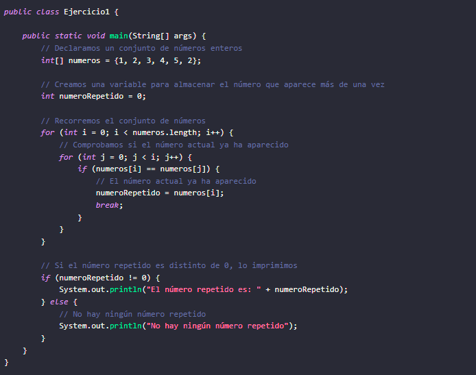
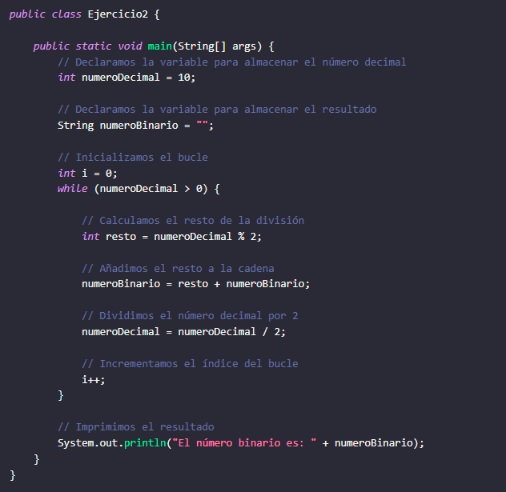
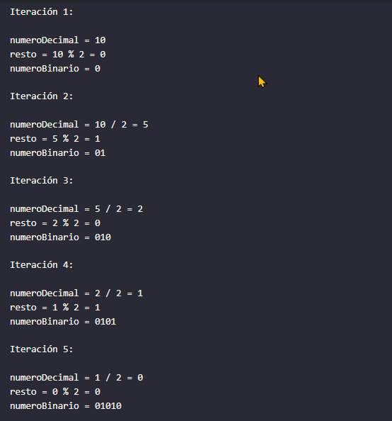
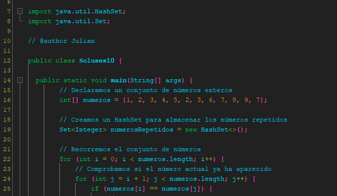
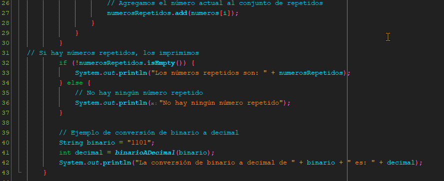
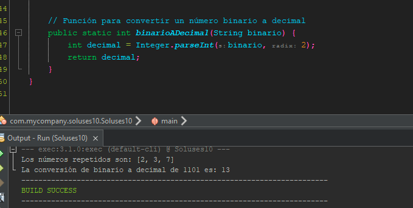

<!-- No borrar o modificar -->
[Inicio](./index.md)

## Sesión 11 

<!-- Su documentación aquí -->
# **Ejercicios de Lógica de Programación**

## **Ejercicio 1**

Dado un conjunto de números enteros, se debe determinar si existe un número que aparezca más de una vez. Si existe, se debe imprimir su valor.

## **Ejercicio 2**

Conversión de decimal a binario. La conversión de decimal a binario es el proceso de convertir un número decimal a su representación binaria.
El sistema binario es un sistema de numeración basado en dos dígitos, 0 y 1.

**Utilizando bucle while**

**Utilizando bucle for**

Este algoritmo funciona dividiendo el número decimal por 2 repetidamente. Cada vez que se divide el número, el resto se almacena en la cadena. El proceso se repite hasta que el número decimal es 0.

Por ejemplo, para convertir el número decimal 10 a binario, el algoritmo funcionaría de la siguiente manera:

# **SOLUCION**

**HashSet** es una estructura de datos en Java que se utiliza para almacenar elementos únicos, es decir, no permite duplicados. Cada elemento en un HashSet es único, y la estructura se utiliza para implementar conjuntos en Java. Al utilizar un HashSet, aseguramos que no se almacenan duplicados en la colección, lo que es útil cuando deseas encontrar elementos repetidos en un conjunto de datos.

En el código que proporcioné, se utiliza un HashSet llamado numerosRepetidos para almacenar los números que se encuentran más de una vez en el conjunto. La razón de usar un HashSet es que garantiza que los elementos duplicados se eliminarán automáticamente, ya que no permite duplicados. Cuando se encuentra un número repetido, se agrega al HashSet, y al final, puedes imprimir los números repetidos que se encuentran en este conjunto.

Usar un HashSet simplifica la lógica del código para encontrar elementos duplicados en comparación con otras estructuras de datos, como un ArrayList o un array convencional, donde tendrías que escribir más código personalizado para administrar duplicados.