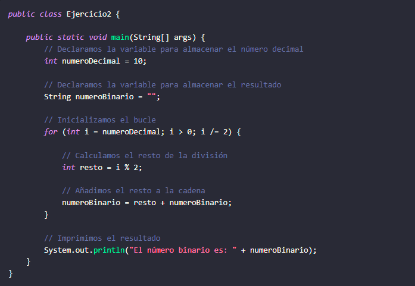
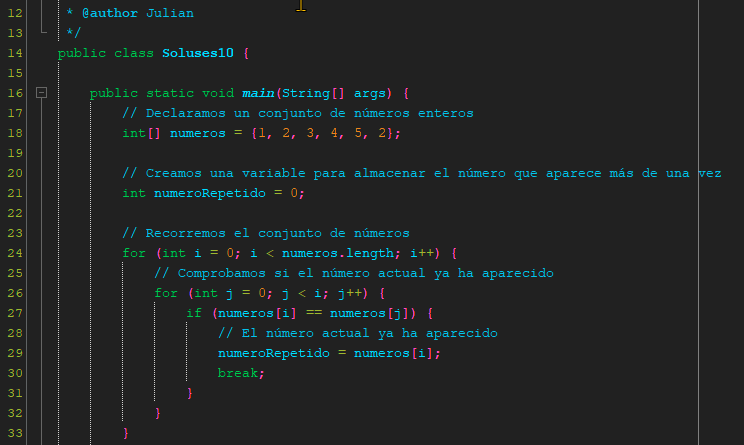

<!-- No borrar o modificar -->
[Inicio](./index.md)

## Sesión 11 

<!-- Su documentación aquí -->
# **Ejercicios de Lógica de Programación**

## **Ejercicio 1**

Dado un conjunto de números enteros, se debe determinar si existe un número que aparezca más de una vez. Si existe, se debe imprimir su valor.

## **Ejercicio 2**

Conversión de decimal a binario. La conversión de decimal a binario es el proceso de convertir un número decimal a su representación binaria.
El sistema binario es un sistema de numeración basado en dos dígitos, 0 y 1.

**Utilizando bucle while**

**Utilizando bucle for**

Este algoritmo funciona dividiendo el número decimal por 2 repetidamente. Cada vez que se divide el número, el resto se almacena en la cadena. El proceso se repite hasta que el número decimal es 0.

Por ejemplo, para convertir el número decimal 10 a binario, el algoritmo funcionaría de la siguiente manera:

# **SOLUCION**

## **Ejercicio 1**

## **Ejercicio 2**
**Utilizando bucle while**

**Utilizando bucle for**

