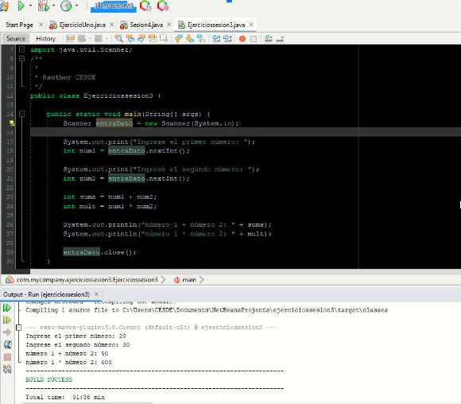
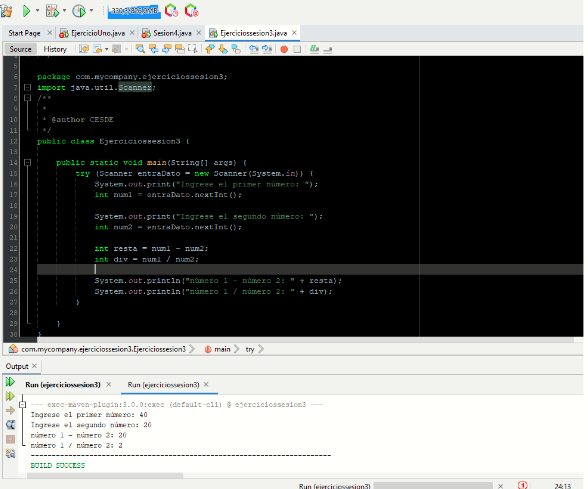
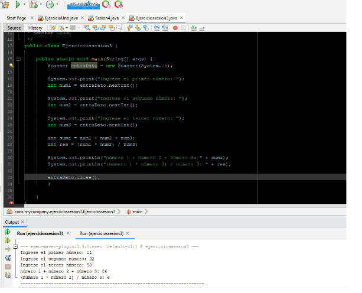
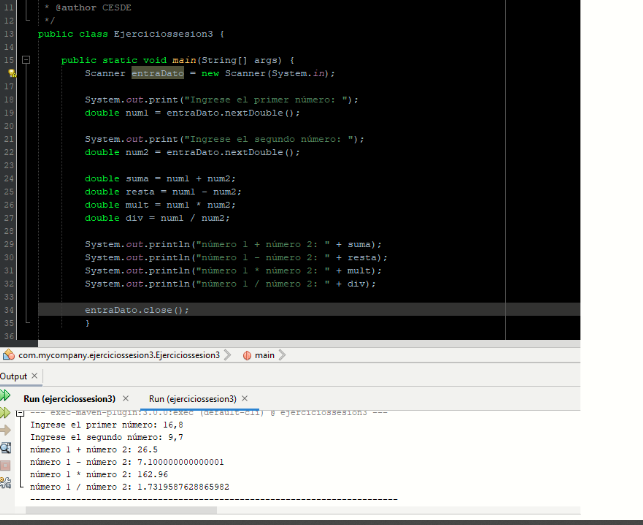
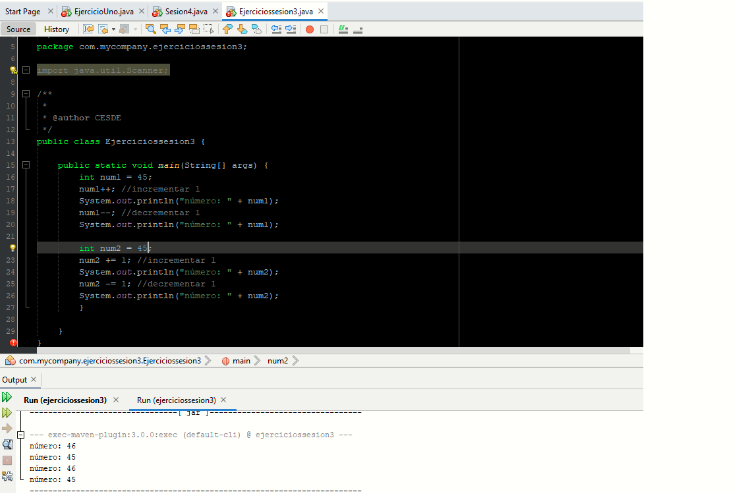
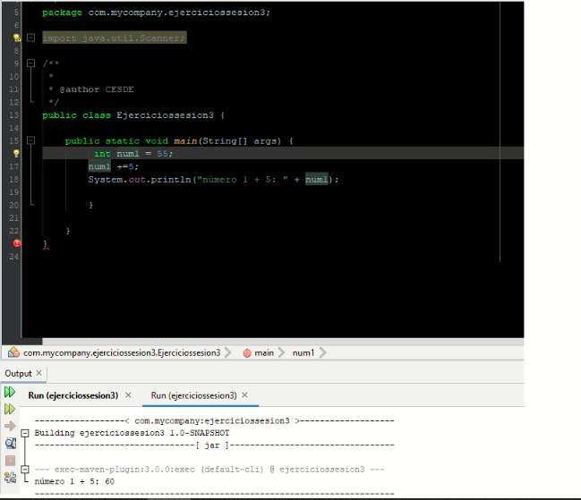
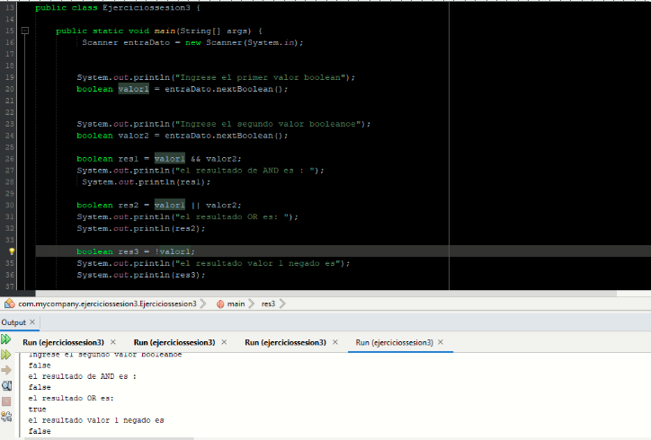
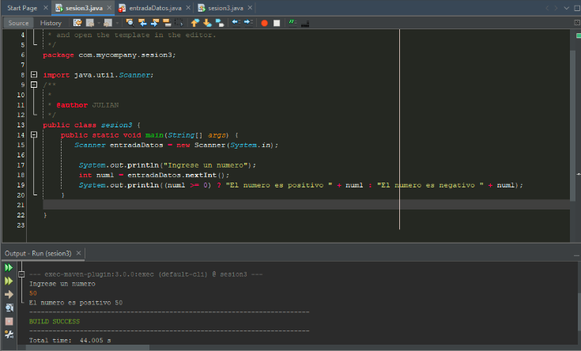

<!-- No borrar o modificar -->
[Inicio](./index.md)

## Sesión 3 

<!-- Su documentación aquí -->

Operadores aritméticos
Los operadores aritméticos en Java se utilizan para realizar operaciones matemáticas básicas. Los operadores aritméticos incluyen:

Suma (+): se utiliza para sumar dos valores.
int a = 5;
int b = 10;
int c = a + b; // c es igual a 15

Resta (-): se utiliza para restar un valor de otro.
int a = 10;
int b = 5;
int c = a - b; // c es igual a 5

Multiplicación (*): se utiliza para multiplicar dos valores.
int a = 5;
int b = 10;
int c = a * b; // c es igual a 50

División (/): se utiliza para dividir un valor entre otro.
int a = 10;
int b = 5;
int c = a / b; // c es igual a 2

Módulo (%): se utiliza para obtener el resto de una división entre dos valores.
int a = 10;
int b = 3;
int c = a % b; // c es igual a 1

Ejemplos
public class OperadoresAritmeticos {

    public static void main(String[] args) {
        int x = 10;
        int y = 5;

        // Suma
        int resultadoSuma = x + y;
        System.out.println("El resultado de la suma es: " + resultadoSuma);

        // Resta
        int resultadoResta = x - y;
        System.out.println("El resultado de la resta es: " + resultadoResta);

        // Multiplicación
        int resultadoMultiplicacion = x * y;
        System.out.println("El resultado de la multiplicación es: " + resultadoMultiplicacion);

        // División
        int resultadoDivisionEntera = x / y;
        System.out.println("El resultado de la división entera es: " + resultadoDivisionEntera);

        double resultadoDivisionDecimal = (double) x / y;
        System.out.println("El resultado de la división decimal es: " + resultadoDivisionDecimal);

        // Módulo
        int resultadoModulo = x % y;
        System.out.println("El resultado del módulo es: " + resultadoModulo);

        // Incremento
        x++;
        System.out.println("El valor de x después del incremento es: " + x);

        // Decremento
        y--;
        System.out.println("El valor de y después del decremento es: " + y);
    }
}

Operadores de Asignación
En Java, los operadores de asignación son símbolos que se utilizan para asignar valores a las variables. Además de la asignación básica (=), Java ofrece otros operadores de asignación que combinan la asignación con una operación matemática. Estos operadores de asignación son útiles para simplificar y acortar el código en situaciones donde se realiza una operación aritmética y luego se asigna el resultado a una variable.

A continuación se describen los operadores de asignación disponibles en Java:

Operador de asignación básico (=)
Se utiliza para asignar un valor a una variable. Por ejemplo:

int x = 5;

Operador de asignación compuesta de suma (+=)
Se utiliza para sumar un valor a una variable y luego asignar el resultado a la misma variable. Por ejemplo:

x += 3; es equivalente a x = x + 3;

Operador de asignación compuesta de resta (-=)
Se utiliza para restar un valor de una variable y luego asignar el resultado a la misma variable. Por ejemplo:

x -= 2; es equivalente a x = x - 2;

Operador de asignación compuesta de multiplicación (*=)
Se utiliza para multiplicar una variable por un valor y luego asignar el resultado a la misma variable. Por ejemplo:

x *= 4; es equivalente a x = x * 4;

Operador de asignación compuesta de división (/=)
Se utiliza para dividir una variable por un valor y luego asignar el resultado a la misma variable. Por ejemplo:

x /= 2; es equivalente a x = x / 2;

Operador de asignación compuesta de módulo (%=)
Se utiliza para calcular el módulo de una variable por un valor y luego asignar el resultado a la misma variable. Por ejemplo:

x %= 3; es equivalente a x = x % 3;

Operador de asignación compuesta de desplazamiento a la izquierda (<<=)
Se utiliza para desplazar los bits de una variable a la izquierda por un número de posiciones y luego asignar el resultado a la misma variable. Por ejemplo:

x <<= 2; es equivalente a x = x << 2;

Operador de asignación compuesta de desplazamiento a la derecha (>>=)
Se utiliza para desplazar los bits de una variable a la derecha por un número de posiciones y luego asignar el resultado a la misma variable. Por ejemplo:

x >>= 1; es equivalente a x = x >> 1;

Operador de asignación compuesta de desplazamiento a la derecha sin signo (>>>=)
Se utiliza para desplazar los bits de una variable a la derecha sin signo por un número de posiciones y luego asignar el resultado a la misma variable. Por ejemplo:

x >>>= 3; es equivalente a x = x >>> 3;

Es importante recordar que los operadores de asignación compuesta realizan la operación indicada y luego asignan el resultado a la misma variable. Por lo tanto, la variable se modifica en el lugar en el que se encuentra sin necesidad de declarar una nueva variable.

Ejemplos
public class OperadoresAsignacion {

    public static void main(String[] args) {
        int a = 10;
        int b = 5;

        // Operador de asignación simple
        int c = a + b;
        System.out.println("c = " + c);

        // Operadores de asignación compuestos
        a += b; // equivalente a a = a + b;
        System.out.println("a = " + a);

        b -= 3; // equivalente a b = b - 3;
        System.out.println("b = " + b);

        c *= 2; // equivalente a c = c * 2;
        System.out.println("c = " + c);

        double d = 6.0;
        d /= 2; // equivalente a d = d / 2;
        System.out.println("d = " + d);

        int e = 7;
        e %= 3; // equivalente a e = e % 3;
        System.out.println("e = " + e);

        // Operador de concatenación de cadenas
        String s1 = "Hola";
        String s2 = "Mundo";
        String s3 = s1 + " " + s2;
        System.out.println(s3); // Hola Mundo

        // Operador de asignación ternario
        int edad = 18;
        String mensaje = (edad >= 18) ? "Eres mayor de edad" : "Eres menor de edad";
        System.out.println(mensaje);
    }
}

Operadores de comparación
En Java, los operadores de comparación se utilizan para comparar dos valores y evaluar si una determinada condición es verdadera o falsa. A continuación, se muestran los operadores de comparación más comunes en Java, junto con sus nombres y descripciones:

Operador de igualdad (==)
Nombre: Igual a Descripción: Comprueba si dos valores son iguales.

int a = 5;
int b = 7;
boolean resultado = (a == b); // false

Operador de desigualdad (!=)
Nombre: No igual a Descripción: Comprueba si dos valores son diferentes.

int a = 5;
int b = 7;
boolean resultado = (a != b); // true

Operador mayor que (>)
Nombre: Mayor que Descripción: Comprueba si el valor de la izquierda es mayor que el valor de la derecha.

int a = 5;
int b = 7;
boolean resultado = (a > b); // false

Operador menor que (<)
Nombre: Menor que Descripción: Comprueba si el valor de la izquierda es menor que el valor de la derecha.

int a = 5;
int b = 7;
boolean resultado = (a < b); // true

Operador mayor o igual que (>=)
Nombre: Mayor o igual que Descripción: Comprueba si el valor de la izquierda es mayor o igual que el valor de la derecha.

int a = 5;
int b = 7;
boolean resultado = (a >= b); // false

Operador menor o igual que (<=)
Nombre: Menor o igual que Descripción: Comprueba si el valor de la izquierda es menor o igual que el valor de la derecha.

int a = 5;
int b = 7;
boolean resultado = (a <= b); // true

Ejemplos
public class OperadoresComparación {

    public static void main(String[] args) {        
        int x = 5;
        int y = 10;
        boolean esIgual = (x == y); // Devuelve false, porque x no es igual a y.
        boolean esDiferente = (x != y); // Devuelve true, porque x es diferente a y.
        boolean esMenor = (x < y); // Devuelve true, porque x es menor que y.
        boolean esMayor = (x > y); // Devuelve false, porque x no es mayor que y.
        boolean esMenorIgual = (x <= y); // Devuelve true, porque x es menor o igual que y.
        boolean esMayorIgual = (x >= y); // Devuelve false, porque x no es mayor o igual que y.
    }
}

Operadores lógicos
Los operadores lógicos en Java permiten realizar operaciones booleanas entre dos o más expresiones. Estos operadores son muy útiles en la toma de decisiones y en la evaluación de condiciones en una variedad de situaciones. Los tres operadores lógicos en Java son AND (&&), OR (||) y NOT (!).

Aquí te explico cómo funcionan estos operadores:

AND (&&)
Este operador retorna true si ambas expresiones a su izquierda y derecha son verdaderas. Si al menos una de las expresiones es falsa, retorna false. Por ejemplo:

boolean a = true;
boolean b = false;
boolean resultado = a && b; // false

OR (||)
Este operador retorna true si al menos una de las expresiones a su izquierda o derecha es verdadera. Si ambas expresiones son falsas, retorna false. Por ejemplo:

boolean a = true;
boolean b = false;
boolean resultado = a || b; // true

NOT (!)
Este operador invierte el valor booleano de la expresión a su derecha. Si la expresión es verdadera, retorna false, y si es falsa, retorna true. Por ejemplo:

boolean a = true;
boolean resultado = !a; // false

Además, también es posible combinar estos operadores para formar expresiones booleanas más complejas, utilizando paréntesis para establecer el orden de evaluación. Por ejemplo:

boolean a = true;
boolean b = false;
boolean c = true;
boolean resultado = (a || b) && !c; // false

En este ejemplo, primero se evalúa la expresión (a || b), que retorna true. Luego, se aplica el operador NOT a la variable c, que es verdadera, resultando en false. Finalmente, se aplica el operador AND a los resultados anteriores, lo que resulta en false.

Ejemplos
public class OperadoresLogicos {
    public static void main(String[] args) {
        int edad = 25;
        boolean esEstudiante = true;
        boolean esDiaLaboral = false;
        boolean esVacaciones = true;

        boolean resultado1 = (edad > 18) && esEstudiante;
        boolean resultado2 = esDiaLaboral || esVacaciones;
        boolean resultado3 = !esDiaLaboral;

        System.out.println("El resultado 1 es: " + resultado1);
        System.out.println("El resultado 2 es: " + resultado2);
        System.out.println("El resultado 3 es: " + resultado3);
    }
}

# **Actividad 3: Ejercicios de operaciones básicas en Java.**

1. **Suma y multiplicación:** Escribe un programa que solicite al usuario dos números enteros y luego imprima la suma y multiplicación de esos números.

1. **Resta y división:** Escribe un programa que tome dos números enteros ingresados por el usuario y calcule la resta y división de esos números.

1. **Operaciones combinadas:** Escribe un programa que solicite al usuario tres números enteros y realice las siguientes operaciones: suma de los tres números, multiplicación del primer número por el segundo y división del resultado entre el tercer número.

1. **Operaciones con decimales:** Escribe un programa que solicite al usuario dos números decimales y realice las siguientes operaciones: suma, resta, multiplicación y división.

1. **Incremento y decremento:** Escribe un programa que declare una variable entera y la inicialice con un valor. Luego, incrementa su valor en 1 y muestra el resultado. Después, decrementa su valor en 1 y muestra el resultado nuevamente.

1. **Operador de asignación compuesta:** Escribe un programa que declare una variable entera y la inicialice con un valor. Utiliza el operador de asignación compuesta para sumar 5 a la variable y luego mostrar su valor.

1. **Operadores lógicos:** Escribe un programa que tome dos valores booleanos ingresados por el usuario y muestre el resultado de las operaciones lógicas AND, OR y NOT entre esos valores.

1. **Operador ternario:** Escribe un programa que tome un número entero ingresado por el usuario y utilice el operador ternario para determinar si el número es positivo o negativo. Luego, muestra el resultado en la salida.

