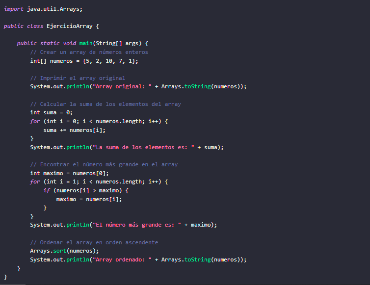
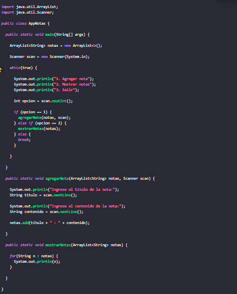
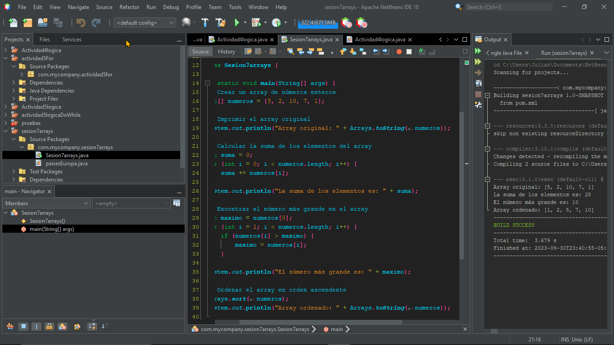
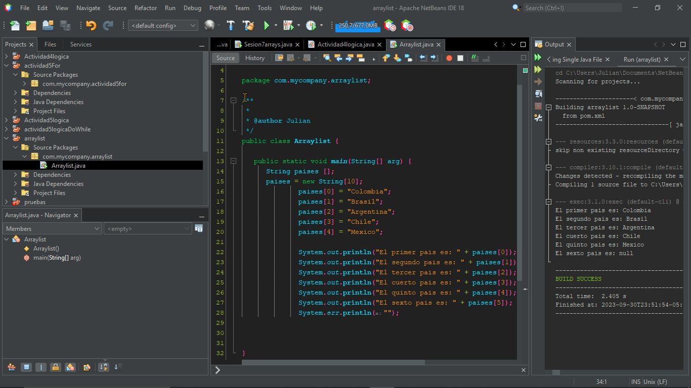

<!-- No borrar o modificar -->
[Inicio](./index.md)

## Sesión 7 

<!-- Su documentación aquí -->

**Array**
Un array en Java es una estructura de datos que permite almacenar una colección de elementos, todos del mismo tipo, en una única variable. Los arrays en Java son de tamaño fijo, lo que significa que una vez creados, no se pueden cambiar en tamaño.

Los arrays en Java se declaran utilizando la siguiente sintaxis:
tipo[] nombreArray = new tipo[tamaño];

Donde:

tipo: es el tipo de los elementos que se almacenarán en el array.
nombreArray: es el nombre de la variable que se utilizará para acceder al array.
tamaño: es el número de elementos que se almacenarán en el array.
Por ejemplo, el siguiente código crea un array de números enteros de tamaño 10:
int[] numeros = new int[10];

Para asignar valores a los elementos de un array, se puede utilizar la siguiente sintaxis:

nombreArray[índice] = valor;

Donde:

índice es el índice del elemento al que se quiere asignar el valor.
valor es el valor que se quiere asignar al elemento.
Por ejemplo, el siguiente código asigna los valores 1, 2, 3, 4, 5, 6, 7, 8, 9 y 10 a los elementos del array numeros:
numeros[0] = 1;
numeros[1] = 2;
numeros[2] = 3;
numeros[3] = 4;
numeros[4] = 5;
numeros[5] = 6;
numeros[6] = 7;
numeros[7] = 8;
numeros[8] = 9;
numeros[9] = 10

Para obtener el valor de un elemento de un array, se puede utilizar la siguiente sintaxis:

valor = nombreArray[índice];

Donde:

valor: es la variable que se utilizará para almacenar el valor del elemento.
índice: es el índice del elemento cuyo valor se quiere obtener.
Por ejemplo, el siguiente código imprime el valor del elemento 5 del array numeros:

int valor = numeros[5];
System.out.println(valor);

Además de la forma que se mencionó anteriormente, hay otra forma de inicializar un array en Java utilizando un inicializador de array. Un inicializador de array es una lista de valores separados por comas que se utiliza para inicializar los elementos de un array.

La sintaxis de un inicializador de array es la siguiente:
tipo[] nombreArray = {valor1, valor2, ..., valorN};

Donde:

tipo: es el tipo de los elementos que se almacenarán en el array.
nombreArray: es el nombre de la variable que se utilizará para acceder al array. valor1, valor2, ..., valorN son los valores que se utilizarán para inicializar los elementos del array.
Por ejemplo, el siguiente código crea un array de números enteros de tamaño 10 e inicializa los elementos con los valores 1, 2, 3, 4, 5, 6, 7, 8, 9 y 10:

int[] numeros = {1, 2, 3, 4, 5, 6, 7, 8, 9, 10};

Los inicializadores de array son una forma conveniente de inicializar los elementos de un array. Se pueden utilizar para inicializar los elementos de un array con valores específicos o con valores predeterminados.

**Los arrays en Java se pueden utilizar para una gran variedad de tareas, como:**

Almacenar una lista de números, cadenas, objetos, etc. Almacenar los nombres de los estudiantes de una clase. Almacenar los precios de los productos de una tienda. Almacenar las puntuaciones de un juego. Almacenar las coordenadas de un mapa.

Los arrays son una herramienta muy versátil que se puede utilizar en una gran variedad de escenarios.

**ArrayList**

En Java, la clase ArrayList se utiliza para almacenar una colección de objetos de tamaño variable. Es una implementación de la interfaz List, que proporciona una serie de métodos para manipular una lista de elementos.

**Creación de una ArrayList:**

Para crear una ArrayList, utilizamos el constructor new ArrayList(). Podemos especificar el tipo de elementos que se almacenarán en la lista, o dejar el tipo como genérico.

Sintaxis:

ArrayList<String> cars = new ArrayList<>();

Este código crea una ArrayList de cadenas vacía. También podemos crear una ArrayList con elementos preexistentes, pasando una matriz o una colección como argumento al constructor.

String[] cars = {"Volvo", "BMW", "Mercedes"};
ArrayList<String> carsList = new ArrayList<>(cars);

Este código crea una ArrayList de cadenas con los elementos de la matriz cars.

**Adición de elementos**

Podemos agregar elementos a una ArrayList utilizando el método add(). Este método toma un elemento como argumento y lo agrega al final de la lista.

carsList.add("Audi");

Este código agrega el elemento "Audi" a la lista carsList. También podemos agregar elementos a una posición específica en la lista utilizando el método add() con un índice como argumento.

carsList.add(1, "Toyota");

Este código agrega el elemento "Toyota" en la segunda posición de la lista carsList.

**Eliminar elementos**

Podemos eliminar elementos de una ArrayList utilizando el método remove(). Este método toma un elemento como argumento y lo elimina de la lista.

carsList.remove("BMW");

Este código elimina el elemento "BMW" de la lista carsList. También podemos eliminar elementos de una posición específica en la lista utilizando el método remove() con un índice como argumento.

carsList.remove(2);

Este código elimina el elemento en la tercera posición de la lista carsList.

**Obtener elementos**

Podemos obtener elementos de una ArrayList utilizando el método get(). Este método toma un índice como argumento y devuelve el elemento en esa posición.

String car = carsList.get(0);

Este código devuelve la cadena en la primera posición de la lista carsList.

**Tamaño de una ArrayList**

Podemos obtener el tamaño de una ArrayList utilizando el método size(). Este método devuelve el número de elementos en la lista.

int size = carsList.size();

Este código devuelve el tamaño de la lista carsList.

Ejemplo de ArrayList
El siguiente ejemplo muestra cómo utilizar la clase ArrayList:

import java.util.ArrayList;

public class ArrayListExample {

    public static void main(String[] args) {
        ArrayList<String> cars = new ArrayList<>();
        cars.add("Volvo");
        cars.add("BMW");
        cars.add("Mercedes");
        cars.add("Audi");

        // Display the list of cars
        for (String car : cars) {
            System.out.println(car);
        }

        // Remove the first car
        cars.remove(0);

        // Display the list of cars
        for (String car : cars) {
            System.out.println(car);
        }
    }
}

Este código crea una ArrayList de cadenas con cuatro elementos. A continuación, muestra la lista de coches. A continuación, se elimina el primer coche de la lista y se muestra de nuevo la lista.

Ventajas de ArrayList
Las ventajas de utilizar ArrayList incluyen:

La capacidad de almacenar una colección de objetos de tamaño variable.
La posibilidad de acceder a los elementos de la lista de forma aleatoria.
La implementación de una serie de métodos para manipular una lista de elementos.
Desventajas de ArrayList
Las desventajas de utilizar ArrayList incluyen:

El uso de más memoria que una matriz de tamaño fijo.
La posibilidad de ineficiencias en operaciones como la adición y la eliminación de elementos.

# **Actividad: Ejecicios Array - ArrayList**

1. En parejas, probar, analizar y explicar el funcionamiento de los siguientes ejemplos de Array y ArrayList.

- Ejemplo Array:

- Ejemplo Array list:

2. Crear un ejemplo de Array y otro de ArrayList para visualizar sus diferencias.

- 

- 

