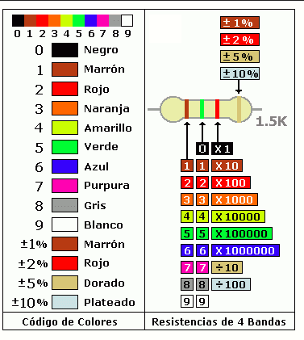

<!-- No borrar o modificar -->
[Inicio](./index.md)

## Sesión 9 

<!-- Su documentación aquí -->

# **Ejercicios de Lógica de Programación**

1. ## **Calculadora de resistencias eléctricas**

Una resistencia eléctrica es un componente electrónico que se utiliza para limitar el flujo de corriente eléctrica en un circuito. Es decir, su función es oponerse al paso de la corriente eléctrica y disminuir su intensidad.

Las resistencias se componen generalmente de un material conductor, como el carbono o el metal, que se coloca en un cuerpo cerámico o de vidrio. El valor de la resistencia (es decir, la cantidad de oposición que ofrece al paso de la corriente eléctrica) se mide en ohms, y depende de la composición del material y de su geometría.

Las resistencias se utilizan en una gran variedad de circuitos electrónicos, tanto en circuitos analógicos como digitales. Algunas de las aplicaciones más comunes de las resistencias incluyen la limitación de corriente en circuitos de alimentación, el ajuste de niveles de voltaje y corriente en circuitos de amplificación, y la medición de corriente y voltaje en circuitos de control y monitoreo.

Calculadora Código de colores - Online

[calculadoraderesistencias](https://www.digikey.com/es/resources/conversion-calculators/conversion-calculator-resistor-color-code)

El objetivo de este ejercicio es crear un programa en Java que permita calcular el valor de una resistencia eléctrica a partir de los colores de sus bandas, y que tenga en cuenta la tolerancia.

Para ello, el programa debe solicitar al usuario que elija los colores de las tres bandas de la resistencia a través de un menú de opciones. Los colores disponibles son: negro, marrón, rojo, naranja, amarillo, verde, azul, violeta, gris y blanco.

Una vez que el usuario ha elegido los colores de las tres bandas, el programa debe pedir al usuario que seleccione la tolerancia de la resistencia a través de otro menú de opciones. Las opciones disponibles son: marrón (1%), rojo (2%), oro (5%) y plata (10%). Si el usuario no selecciona ninguna opción válida, se debe utilizar la tolerancia por defecto del 5%.

Con los colores y la tolerancia seleccionados, el programa debe calcular el valor de la resistencia y mostrarlo en la consola, junto con la tolerancia seleccionada.

Para calcular el valor de la resistencia, se debe utilizar la fórmula: valor = ((valor1 10) + valor2) multiplicador, donde valor1 y valor2 son los valores correspondientes a los dos primeros colores elegidos por el usuario (según la tabla de colores), y multiplicador es el valor correspondiente al tercer color elegido por el usuario (también según la tabla de colores). Finalmente, se debe mostrar el valor de la resistencia en ohms y la tolerancia seleccionada.

1. ## **Calculadora de la mediana**

La mediana es un valor estadístico que se utiliza para describir el centro de un conjunto de datos. Es el valor que se encuentra justo en el medio de un conjunto de datos ordenados de menor a mayor. Es decir, la mediana divide el conjunto de datos en dos partes iguales, donde la mitad de los valores están por encima de la mediana y la otra mitad están por debajo de ella.

Mediana con números impares:

Supongamos este grupo de números: {3, 7, 4, 2, 8}

Ordenarlos de menor a mayor: {2, 3, 4, 7, 8} El número de elementos es impar (5 elementos), por lo que la mediana será el elemento central una vez ordenados. El elemento central es el número 4. Por lo tanto, la mediana de este grupo de números impares es 4.

Mediana con números pares:

Supongamos este otro grupo: {5, 12, 2, 11, 3, 9}

Ordenarlos de menor a mayor: {2, 3, 5, 9, 11, 12} El número de elementos es par (6 elementos), por lo que la mediana será el promedio de los 2 elementos centrales una vez ordenados. Los elementos centrales son el 5 y el 9. El promedio de 5 y 9 es (5 + 9) / 2 = 7 Por lo tanto, la mediana de este grupo de números pares es 7.

La mediana es el elemento central de un grupo ordenado cuando la cantidad de elementos es impar. Y es el promedio de los dos elementos centrales cuando la cantidad es par.

# **Solucion**

## **Calcular la mediana**
